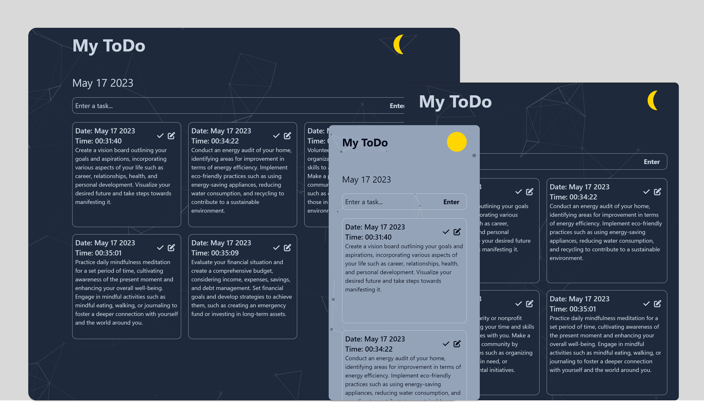

## Contact me

[![linkedin-shield]][linkedin-url] [![gmail-shield]][gmail-url] [![facebook-shield]][facebook-url] [![instagram-shield]][instagram-url] [![twitter-shield]][twitter-url]

<!-- PROJECT LOGO -->
<br>
<div align="center">
  <a href="https://maksymyatsun.github.io/to_do_local_storage/" style="color: white;"><h1><b>ToDo app</b></h1></a>

<h3 align="center">Simple ToDo app created with TailwindCSS</h3>
<br></br>
  <a href="https://maksymyatsun.github.io/to_do_local_storage/"></a>
</div>

<!-- ABOUT THE PROJECT -->

## Try it Out

https://maksymyatsun.github.io/to_do_local_storage/

## Built With

- [tailwindcss] version: 3.3.2
- [npm] version: 9.6.3
- [node] version: 18.12.1
- [anime] version: 0.1.2
- [particles] version: 0.3.1

<!-- GETTING STARTED -->

## Getting Started

To get a local copy up and running follow these simple example steps.

1. Install Node.js on your system [https://nodejs.dev/en/download/](https://nodejs.dev/en/download/)
2. Clone a repo with git
   ```sh
   git clone https://github.com/MaksymYatsun/to_do_local_storage.git
   ```
3. Start the Tailwind CLI build process:
   ```sh
   npx tailwindcss -i ./src/input.css -o ./dist/output.css --watch
   ```

<!-- MARKDOWN LINKS & IMAGES -->

[tailwindcss]: https://tailwindcss.com/
[npm]: https://www.npmjs.com/
[node]: https://nodejs.org/en/
[anime]: https://animejs.com/
[particles]: https://vincentgarreau.com/particles.js/
[linkedin-url]: https://www.linkedin.com/in/maksym-yatsun-3637bb231/
[linkedin-shield]: https://img.shields.io/badge/-LinkedIn-black.svg?style=for-the-badge&logo=linkedin&colorB=555
[gmail-url]: https://mail.google.com/mail/u/?authuser=egocogitio3.14@gmail.com
[gmail-shield]: https://img.shields.io/badge/Gmail-D14836?style=for-the-badge&logo=gmail&logoColor=white&
[facebook-shield]: https://img.shields.io/badge/Facebook-%231877F2.svg?style=for-the-badge&logo=Facebook&logoColor=white
[facebook-url]: https://www.facebook.com/maxim.yatsun.9
[instagram-shield]: https://img.shields.io/badge/Instagram-%23E4405F.svg?style=for-the-badge&logo=Instagram&logoColor=white
[instagram-url]: https://www.instagram.com/maxym.yatsun/
[twitter-shield]: https://img.shields.io/badge/Twitter-%231DA1F2.svg?style=for-the-badge&logo=Twitter&logoColor=white
[twitter-url]: https://twitter.com/maxon67277076